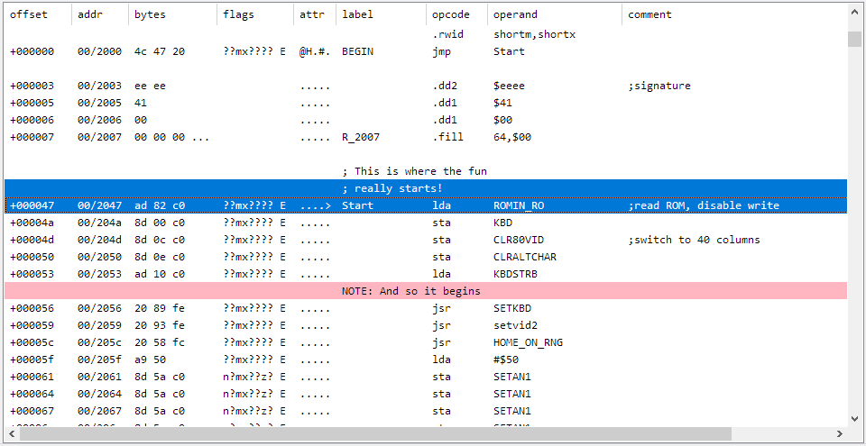

# Disassembler UI Test #

I'm porting the [6502bench](https://github.com/fadden/6502bench) user
interface from WinForms to WPF.  Replicating the main code interaction
window has proven to be a challenge.  I created this project as a
sandbox for experiments.

The central part of the UI looks like this:

Key things to note:

 * The list has resizable columns and full-line multi-select.  It does
   not allow columns to be rearranged or sorted.
 * Most rows have 9 columns.  Some rows have full-line comments or "notes",
   which start in the Label column and extend to the end of the Comment
   column.  (If you collapse the first 5 columns, you're left with what
   looks like a source listing.)
 * Some individual cells may get color highlights, e.g. if you select
   "jmp Start" (offset +000000), the Addr and Label columns at the target
   line (offset +000047) will have their backgrounds set to light blue.
   Notes may have a background color set.  (This was not implemented here.)
 * I don't particularly want mouse-over highlighting, but I do need the
   selected row(s) to be highlighted.  (This gets lost when you replace the
   control template).
 * Sometimes lines get reformatted in a way that expands or contracts them
   (e.g. changing a string to a byte dump, with one byte per line).  I need
   to save and restore the selection such that the same range of bytes is
   selected before and after.  This requires programatically setting the
   selection, possibly on many thousands of items.  (A full bank dump will
   have up to 65536 lines.)
 * Some changes can affect a large number of lines (e.g. adding or removing
   a code entry point).  This requires alerting the UI that a number of
   lines have changed.  The analysis code doesn't try to maintain
   line-by-line diffs when doing a full code reanalysis, so such changes
   are handled by simply marking all lines as changed.
 * My goal is to have all operations finish in less than 100ms.  (This is
   a common recommendation for interactivity.)

The WinForms version used a ListView control with OwnerDraw.  The only
significant performance issue I encountered was when getting the set of
selected lines.  I dealt with that by maintaining a parallel data structure.

## ListView Style Tests ##

When you run this project, you are given four options for ListView
style tests.  Clicking on a button creates an instance of that type of window.

 * Simple List: the data is presented in a generic ListView.  This lets
   you compare the default style.
 * Multi-Column Template: a partial implementation based on a Stack Overflow
   answer.  The selection highlighting is partially implemented -- you'll
   notice that it's green and doesn't look quite right on the long lines -- and
   the mouse-hover effects don't work on the long lines.
 * GridViewRowPresenter: a variation on the previous, using
   GridViewRowPresenter elements.
 * Fully Styled: a merge of the above with the default WPF style (WPF 4.5
   in Win10).  This should be indistinguishable from the Simple List
   version, except that the "long comments" start in the 5th column and
   span multiple columns.

The current solution doesn't cap the width of the long comment lines, so
if the user shrinks the rightmost columns you'll still see the long comments.
For the case of Notes, this is probably desirable.  I haven't figured out a
way to do this, other than by catching thumb DragDeltaEvents and summing up
column widths into a property in the code-behind.

## Other Tests ##

The Selection Test is an evaluation of an approach that binds the item
selection state to a property in the data item.  This is very fast, but
doesn't appear to work properly when UI virtualization is enabled.

Simple test:

 * Start the test.
 * Click on the first line in the list (item 0).
 * Type Ctrl+A to select all elements.
 * Scroll down to item 500 and click on it.  This should deselect all
   other lines.
 * Scroll up.  Many, but not all, of the lines above are selected.  As you
   scroll over them, the selected item count at the bottom of the screen
   will increase.

If you check the "fix the glitch" box at the bottom, a workaround is
employed that attempts to keep the data item state up to date with the
control's selection state.  If you have some stuff selected when you enable
the feature you'll need to reset the selection state (e.g. hit Ctrl+A then
click on a line) to get things in sync.

If you edit SelectionTestWindow.xaml to set `IsVirtualizing="False"`, the
problem doesn't seem to reproduce.  If you have virtualization enabled and
set `VirtualizationMode="Recycling"`, you will get weird behavior, e.g.
typing Ctrl+A to select all won't quite select all items.

Clicking "Select Even Rows" selects all of the even-numbered rows in the
list, and un-selects the odd-numbered rows.  This is a demonstration of
programmatically selecting items.  Note that the selected item count at the
bottom only reflects the number of items that are currently on screen, but
increases as you scroll around.

This approach starts to fail when the item count gets very large
(hundreds of thousands of items).  If "fix the glitch" is checked, and
you do a select-all operation, everything is fine until you try to scroll
around.  Advancing a single page takes a noticeable amount of time.  If
you un-select everything, the performance returns to normal.  My best
guess is that the ListView is doing some sort of slow update to the
SelectedItems list when it realizes that there are selected items that
aren't in the list.  To see this:

 * In SelectionTestWindow.xaml.cs, change `TEST_ITEM_COUNT` from
   1e3 (1000) to 1e5 (100000).
 * Launch the program, click Selection Test.
 * Check the "Fix the Glitch" checkbox.
 * Click on the first line in the list (item 0).
 * Type Ctrl+A to select all elements.
 * Click in the scroll bar to scroll down a page, or just spin your
   scroll wheel.
 * You should notice that advancing a page at a time has very poor
   performance.  If you click on a line to clear the selection, scrolling
   becomes much faster.

### License ###

The code license is Apache 2.0, so it can be used in free or commercial
products.  There is no NOTICE file, so you don't need to provide attribution
in the shipping product.
